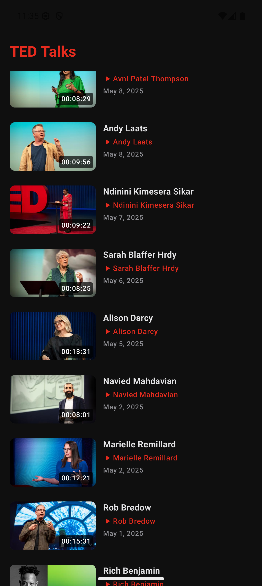
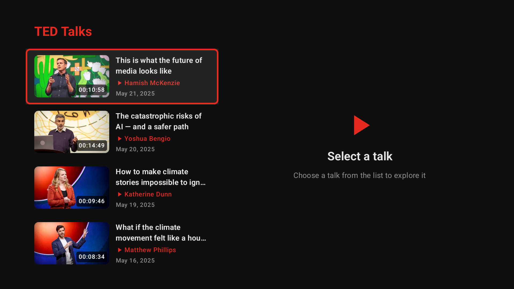

# TED Talks Adaptive Showcase

A high-fidelity Android demonstration app centered around the official [TED Talks HD RSS feed](https://feeds.feedburner.com/TedtalksHD). This project serves as a reference implementation for building deeply adaptive UIs that span the entire Android ecosystem—from compact mobile screens and foldables to large-screen spatial environments like Android XR and lean-back experiences on Google TV.

## 🚀 Key Objectives

- **Live Data Integration:** Real-time fetching and parsing of the TED Talks HD RSS feed.
- **Adaptive Layout Excellence:** Demonstrating how to use a single codebase to support radically different form factors using Jetpack Compose's latest adaptive APIs.
- **Cross-Platform Consistency:** Ensuring a high-quality experience on Phone, Tablet, Foldable, TV, and XR.
- **Adaptive Navigation:** Uses `ListDetailPaneScaffold` and `Navigation3` to provide a seamless experience that scales from single-pane mobile views to multi-pane layouts on foldables, tablets, and XR.
- **Cross-Device Support:**
    - **Mobile/Foldable:** Responsive layout that adapts to posture changes (e.g., table-top mode).
    - **Android TV:** Optimized D-pad navigation, focus management, and overscan-safe margins.
    - **Android XR:** Leverages adaptive primitives for spatial computing environments.
- **Video Playback:** High-performance playback using Media3 ExoPlayer with seamless transitions to fullscreen.
- **Modern UI:** Built entirely with Material 3 and custom dynamic themes.

## 🛠 Tech Stack

- **UI:** [Jetpack Compose](https://developer.android.com/compose) (Material 3)
- **Adaptive Layout:** [androidx.compose.material3.adaptive](https://developer.android.com/develop/ui/compose/layouts/adaptive)
- **Navigation:** [Navigation3](https://developer.android.com/jetpack/androidx/releases/navigation) (Experimental)
- **Media:** [Media3 ExoPlayer](https://developer.android.com/guide/topics/media/exoplayer)
- **Image Loading:** [Coil 3](https://coil-kt.github.io/coil/) (Multiplatform)
- **Networking:** [OkHttp](https://square.github.io/okhttp/)
- **Architecture:** Clean Architecture with ViewModel and Flow-based State Management.

## 🛠 XR Video Playback (Bug Fix)

A specific bug was identified where video playback would fail (invisible/black screen) specifically on the Android XR emulator. 

- **The Problem:** The default Media3 `SurfaceView` implementation uses hardware "hole punching" which conflicted with the spatial compositor in the XR environment. Additionally, some emulator images lacked the root CA certificates required to trust TED's video CDN.
- **The Workaround:** 
    1. Switched the rendering surface from `SurfaceView` to `TextureView` via a custom `view_player.xml` layout to ensure compatibility with 3D spatial compositing.
    2. Implemented a permissive `OkHttpClient` for the `ProgressiveMediaSource` to bypass SSL trust anchor issues common in demo/emulator environments.

## 📱 Previews & Testing

- **Compose Previews:** Key UI components like `TalkListPane` and `TalkDetailPane` are annotated with `@Preview` for rapid iteration and design verification without an emulator.
- **Unit Tests:** `RssFeedParserTest` ensures the Feedburner XML is parsed accurately across different environments, and `MainScreenViewModelTest` covers business logic and state transitions.
- **Instrumented UI Tests:** Includes `MainScreenTest` to ensure that the core adaptive `ListDetailPaneScaffold` and Navigation graph boot up properly without crashing across any form factor (Phone, Foldable, TV, or XR).
- **Performance:** Designed with performance in mind—utilizing efficient Compose state management, `LazyColumn` for lists, and optimized image loading with Coil to prevent dropped frames and ensure smooth scrolling.

## 📱 Screenshots

| Phone | Foldable (Inner) | Android XR | Google TV |
|-------|------------------|------------|-----------|
|  |  |  |  |

## 🛠 Getting Started

### Prerequisites
- Android Studio Ladybug or newer.
- Android SDK 36 (for the latest adaptive and XR APIs).

### Build & Run
```bash
./gradlew installDebug
```

## 📄 License

This project is licensed under the MIT License - see the [LICENSE](LICENSE) file for details.

TED Talks and the TED logo are trademarks of TED Conferences, LLC. This application is an unofficial showcase and is not affiliated with or endorsed by TED Conferences, LLC.
