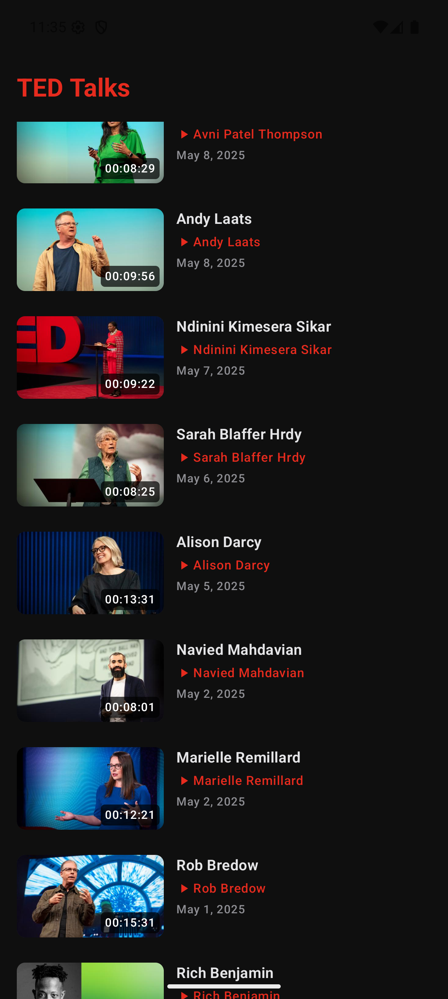
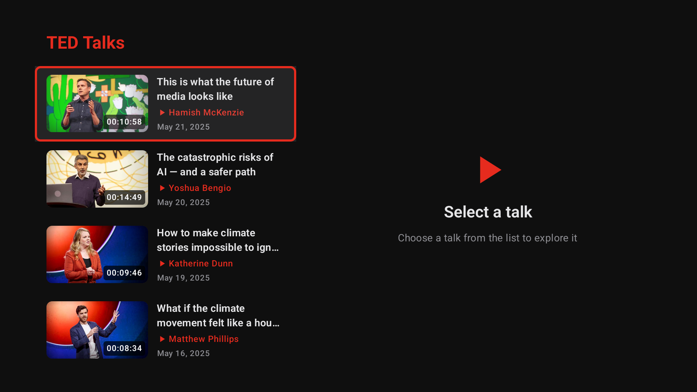
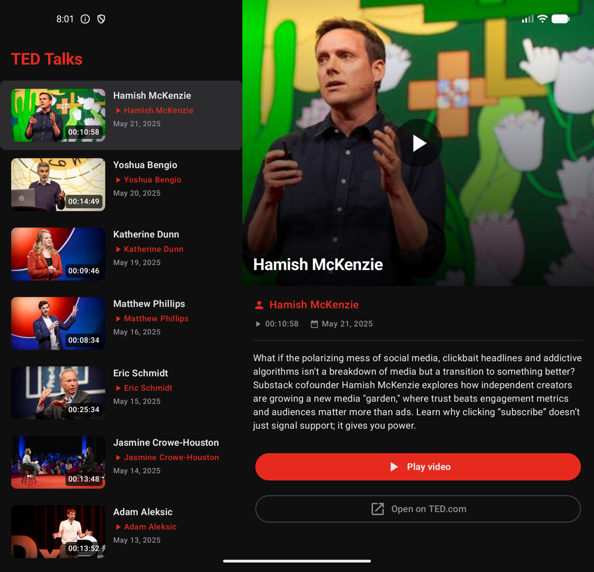

# TED Talks Adaptive Showcase

[](https://github.com/jpcottin/tedtalksapp/actions/workflows/android.yml)

<details>
<summary><b>CI details</b> — build/lint/screenshot jobs + emulator matrix, API 32 → 37.1, plus Android CLI and Emulator Preview legs</summary>

Besides lint, unit tests, Compose screenshot validation, and a debug build, instrumented tests run on GitHub-hosted emulators:

| Legs | Image | Emulator channel | GPU | Gating |
|---|---|---|---|---|
| API 32, 33, 34, 35, 36 | `google_apis` x86_64 | stable | auto | ✅ blocking |
| API 37.0 | `google_apis_ps16k` (16 KB page size) | stable | lavapipe | non-blocking |
| API 37.0 | `google_apis_ps16k` | canary (`--channel=3`) | lavapipe, auto | non-blocking |
| API 37.1 | `google_apis_ps16k` | canary | lavapipe, auto | non-blocking |
| Android CLI experiment | `google_apis_ps16k` 37.0 | canary | emulator default | non-blocking |
| Emulator Preview (`emulators;latest`) | `google_apis_ps16k` 37.0 | preview package | auto | non-blocking |
| Emulator Preview multi-run (snapshot cycles) | `google_apis_ps16k` 37.0 | preview package | auto | non-blocking |
| Android CLI multi-run (snapshot cycles) | `google_apis_ps16k` 37.0 | canary | emulator default | non-blocking |

The Android CLI leg drives the whole flow with the [`android` CLI](https://d.android.com/tools/agents/android-cli) (`android sdk install --canary`, `android emulator create/start/stop`) instead of `sdkmanager`/`avdmanager` and the emulator-runner action.

Two of the non-blocking jobs run a **snapshot multi-run experiment**: the emulator is booted four
times against the same AVD with quickboot snapshots enabled, the app is launched only on the first
cycle, and every later cycle checks whether the snapshot brought it back by itself — still running,
and still rendering. The app is deliberately never relaunched after a restore, since that is the
thing being measured. One job drives the Emulator Preview package, the other the canary emulator
through the `android` CLI, so the same experiment can be compared across both.

Because this app's UI is static between interactions, rendering is judged with `android layout`
rather than by diffing two screenshots — a screenshot diff would report a stall on every cycle. A
non-empty layout tree plus a focused window means the UI is present and enumerable. Screenshots are
still captured and uploaded for every cycle. The preview jobs share their setup through the
composite action in `.github/actions/preview-emulator`, and
`scripts/replay-preview-multirun.sh` replays the multi-run job locally in a few minutes instead of a
push cycle.

All emulator-runner legs use full diagnostics (`-verbose -show-kernel -debug-metrics -metrics-collection`) and a `cmdline-tools;latest` update so `avdmanager` writes a valid `target=android-37.x` (the runner's preinstalled version writes `android-0`, which the emulator clamps to API 3, disabling the Vulkan/GLDirectMem auto-enable the ps16k images need).

</details>

A high-fidelity Android demonstration app centered around the official [TED Talks HD RSS feed](https://feeds.feedburner.com/TedtalksHD). This project serves as a reference implementation for building deeply adaptive UIs that span the entire Android ecosystem—from compact mobile screens and foldables to large-screen spatial environments like Android XR and lean-back experiences on Google TV.

## 🚀 Key Objectives

- **Live Data Integration:** Real-time fetching and parsing of the TED Talks HD RSS feed.
- **Adaptive Layout Excellence:** A single codebase supports radically different form factors using Jetpack Compose's latest adaptive APIs.
- **Cross-Platform Consistency:** High-quality experience on Phone, Tablet, Foldable, TV, and XR.
- **Adaptive Navigation:** Uses **Navigation 3** with `ListDetailSceneStrategy` so the list/detail layout collapses to a single pane on phones and expands to side-by-side panes on foldables, tablets, and XR. Each pane is its own back-stack entry rather than a managed child of a scaffold.
- **Edge-to-edge UI:** The app draws under the system bars (Android 15+ default) and applies `WindowInsets.safeDrawing` everywhere a Scaffold doesn't already handle them.
- **Device traits, not form-factor labels:** Compose's `mediaQuery { }` API decides how the UI behaves from what the device can do: viewing distance drives overscan margins and target sizes, pointer precision drives keyboard/D-pad focus handling, and window posture drives a tabletop layout on foldables.
- **Styles API:** Focus, hover, press and selection states are declared with the Compose Styles API (`androidx.compose.foundation.style`) instead of being tracked by hand in each composable.
- **Cross-Device Support:**
    - **Mobile/Foldable:** Responsive layout that adapts to posture changes (e.g., table-top mode).
    - **Android TV:** Optimized D-pad navigation, focus management, and overscan-safe margins.
    - **Android XR:** Leverages adaptive primitives for spatial computing environments.
- **Video Playback:** High-performance playback using Media3 ExoPlayer with seamless transitions to fullscreen, picture-in-picture when leaving the app mid-playback, per-talk resume positions, and audio focus handling.
- **Modern UI:** Built entirely with Material 3 and a custom dark theme.

## 🛠 Tech Stack

- **UI:** [Jetpack Compose](https://developer.android.com/compose) (Material 3)
- **Adaptive Layout:** [androidx.compose.material3.adaptive](https://developer.android.com/develop/ui/compose/layouts/adaptive) + `adaptive-navigation3`
- **Device traits:** [Compose MediaQuery](https://developer.android.com/develop/ui/compose/layouts/adaptive/mediaquery) (`androidx.compose.ui.mediaQuery`, experimental)
- **Interaction styling:** [Compose Styles](https://developer.android.com/develop/ui/compose/styles/fundamentals) (`androidx.compose.foundation.style`, experimental)
- **Navigation:** [Navigation 3](https://developer.android.com/jetpack/androidx/releases/navigation) with `ListDetailSceneStrategy`
- **Media:** [Media3 ExoPlayer](https://developer.android.com/guide/topics/media/exoplayer)
- **Image Loading:** [Coil 3](https://coil-kt.github.io/coil/) (Multiplatform)
- **Networking:** [OkHttp](https://square.github.io/okhttp/)
- **Architecture:** Clean Architecture with ViewModel + `StateFlow`, a `TedTalksRepository` interface, and constructor-injected dependencies for testability.

## 🧭 Architecture notes

### Navigation 3 list-detail

`Navigation.kt` is the composition root. It builds a `NavBackStack` containing two destinations:

- `TalksList` — annotated with `ListDetailSceneStrategy.listPane(detailPlaceholder = …)`. Always visible; provides a placeholder pane when no talk is selected.
- `TalkDetail(talkId)` — annotated with `ListDetailSceneStrategy.detailPane()`.

`ListDetailSceneStrategy` observes the back stack and the window's adaptive info to render the appropriate scene (single pane vs. side-by-side). The detail pane hides its back button when `maxHorizontalPartitions > 1` because the list pane is already visible.

### Device traits (MediaQuery)

`DeviceTraits.kt` wraps Compose's experimental `mediaQuery { }` API in a handful of named questions the UI asks instead of checking `uiMode` or screen size:

| Trait | Query | Used for |
|---|---|---|
| `isFarViewing()` | `viewingDistance == Far` | 48dp / 27dp overscan-safe padding around the whole UI; an 88dp play target on the hero. |
| `hasNoPointer()` | `pointerPrecision == None` | Focus is the only cursor, so the first list item and the video player take focus as soon as they appear (TV remote, keyboard-only desktop, XR without hand tracking). |
| `hasFinePointer()` | `pointerPrecision == Fine` | A mouse or trackpad is attached: the hero play target shrinks to 56dp. |
| `isTabletopPosture()` | `windowPosture == Tabletop` | A half-opened foldable with a horizontal hinge: the detail pane puts the video or hero image on the upper half and the scrolling text and controls on the lower half, so the fold never cuts through either. |

`isTelevision()` (leanback `uiMode`) is kept only for a platform fact that isn't an adaptive trait: leanback devices have no browser, so the "Open on TED.com" button is hidden there.

The API is gated behind `ComposeUiFlags.isMediaQueryIntegrationEnabled`. Compose reads the flag once per composition root, so `TedTalksApplication.onCreate` turns it on before any Activity composes. When the flag is off (Android Studio previews render without the Application class) each trait falls back to the `uiMode` heuristic the app used before, so previews still render. `LogDeviceTraits()` prints the resolved values to logcat under the `DeviceTraits` tag, which is handy when reading the CI emulator logs.

### Styles

`theme/ComponentStyles.kt` declares the app's interaction styling with the Compose Styles API:

- `TedTalksStyles.focusRing` — a 3dp border that is transparent at rest, animates to the brand red when focused, and shows at half opacity on mouse hover.
- `TedTalksStyles.talkListItem` — shape, content padding, and hover / press / selected backgrounds for a row of the talk list.

The list row applies both with `Modifier.styleable(styleState, focusRing, talkListItem)`, where the `StyleState` comes from `rememberUpdatedStyleState(interactionSource) { it.isSelected = isSelected }` and the same `InteractionSource` is handed to `clickable`. Material buttons don't take a `Style` parameter, so `Modifier.focusRing(interactionSource, shape)` in `FocusSupport.kt` attaches the ring through `Modifier.styleable` using the `InteractionSource` passed to the button. Both APIs need `compileSdk 37` and Compose 1.12, and are opted in project-wide in `app/build.gradle.kts`.

### Edge-to-edge

- `MainActivity.onCreate` calls `enableEdgeToEdge(SystemBarStyle.dark(...), SystemBarStyle.dark(...))` because the app forces a dark Compose theme regardless of the system setting.
- `TalkListPane` uses a Material 3 `Scaffold` with `contentWindowInsets = WindowInsets.safeDrawing`, forwards `innerPadding` to the `LazyVerticalGrid.contentPadding`, and consumes it with `consumeWindowInsets(innerPadding)` so nothing below pads twice.
- `TalkDetailPane`'s hero is intentionally edge-to-edge; the M3 `TopAppBar` overlay applies its own status-bar inset and the text body underneath applies `WindowInsets.safeDrawing.only(Horizontal + Bottom)`.
- The fullscreen video `Dialog` uses `decorFitsSystemWindows = false` and hides the system bars while playing.

### Video playback

- **Picture-in-picture** — `PipSupport.kt` keeps the activity's PiP params in sync with playback: on Android 12+ it uses `setAutoEnterEnabled` so leaving the app during playback enters PiP with a smooth animation (source rect hint fed from the player's on-screen bounds); on Android 8–11 it falls back to entering on the user-leave hint. While in PiP, `TalkDetailPane` renders only the video full-bleed with controls hidden, and the usual pause-on-`ON_PAUSE` is skipped when the pause is caused by entering PiP. The adaptive scaffold collapses to a single pane automatically inside the tiny PiP window.
- **Resume positions** — `TedTalksViewModel` keeps a per-URL playback position map; switching back to a talk seeks to where it left off (`setMediaItem` → `seekTo` → `prepare`). Talks that played to the end restart from the beginning.
- **Audio focus** — the player is built with `setAudioAttributes(..., handleAudioFocus = true)` and `setHandleAudioBecomingNoisy(true)`, so it ducks/pauses correctly for other media apps and pauses when headphones are unplugged. The `ExoPlayer` factory is constructor-injected for unit testing.

### Adaptive list

`TalkListPane` uses `LazyVerticalGrid(columns = GridCells.Adaptive(360.dp))` so it stays single-column on phones (and on the narrow list pane of a two-pane layout) and expands to multiple columns when given more horizontal space. The app bar uses `TopAppBarDefaults.enterAlwaysScrollBehavior()`: it slides away as the grid scrolls down and returns as soon as the user scrolls up, giving the grid the full height on small windows.

### XR / TV specifics

The XR + TV workarounds remain in this branch:

- **Surface rendering (black video area)** — `SurfaceView` uses hardware hole-punching that conflicts with the XR spatial compositor, producing a black rectangle. A custom `view_player.xml` layout (`app:surface_type="texture_view"`) composites the video correctly into the XR panel.
- **SSL trust anchor (Sectigo Root R46)** — the XR emulator ships without Sectigo Public Server Authentication Root R46, the root CA that signs TED's video CDN (`download.ted.com`). `network_security_config.xml` bundles this certificate scoped to `ted.com` and `feedburner.com`; SSL validation is fully preserved for all other domains.
- **Overscan margins** — `Navigation.kt` adds 48dp / 27dp safe-area padding when the MediaQuery viewing distance is `Far` (TV).

### D-pad navigation & focus

- **Visible focus** — Material's default focus indication (a faint state layer) is invisible on image-heavy lean-back layouts, so `TedTalksStyles.focusRing` (a Compose `Style`) draws a 3dp brand-red border on the focused list item, hero play overlay, and detail buttons; see the Styles section above.
- **Player key dispatch** — per the Media3 TV recipe, the inline and fullscreen `PlayerView` wrappers forward Compose key events with `onKeyEvent { playerView.dispatchKeyEvent(it.nativeKeyEvent) }`, and when no pointing device is present (`hasNoPointer()`) the player requests focus when playback starts. DPAD-CENTER shows the controller and toggles play/pause; BACK falls through once the controller is hidden so navigation still pops.
- **Focus restoration** — the talk grid uses `Modifier.focusRestorer(...)`, so backing out of a detail pane returns focus to the item that opened it rather than the top of the list.
- **Two-pane back fix** — in a two-pane scene `ListDetailSceneStrategy` reports no previous entries, which disables `NavDisplay`'s built-in back handling; BACK would close the activity instead of dismissing the detail pane (this affects TV, tablets, foldables, and XR). `MainNavigation` adds a fallback `BackHandler` that pops the back stack; in single-pane scenes `NavDisplay`'s own handler still wins, keeping the predictive-back animation.
- **No browser on TV** — the "Open on TED.com" button is hidden in leanback mode (web links are a dead end on TV) and guarded with `ActivityNotFoundException` elsewhere.

## 🧪 Testing

The repository is wired for constructor injection, so tests can pass a fake without touching the network.

- **`TedTalksRepository`** is an interface; `DefaultTedTalksRepository` is the production implementation.
- **`FakeTedTalksRepository`** lives in `app/src/test/.../data/` and lets tests pin any `Result<List<TalkItem>>`.
- **`DefaultTedTalksRepository`** is tested against an in-process [`MockWebServer`](https://square.github.io/okhttp/features/mockwebserver/) so HTTP error codes, malformed XML, empty bodies, and the request URL/method are all covered without hitting the network.

| Type | Source set | Command | What it covers |
|------|-----------|---------|----------------|
| Unit tests | `src/test/` | `./gradlew :app:testDebugUnitTest` | `RssFeedParser` parsing edge cases, `DefaultTedTalksRepository` HTTP behavior via MockWebServer, and `TedTalksViewModel` state machine (loading / success / error / retry / selection) and playback-position bookkeeping (resume / restart-after-finish) against a mocked `ExoPlayer`. |
| Compose UI tests | `src/androidTest/` | `./gradlew :app:connectedDebugAndroidTest` | `TalkListPane`, `TalkDetailPane`, and the full `MainNavigation` graph (including a back-from-detail regression guard for the two-pane back fix) using `FakeTedTalksRepository`. Pane assertions scroll to off-screen nodes so they pass on TV/wide viewports too. |
| Screenshot tests | `src/screenshotTest/` | `./gradlew :app:updateDebugScreenshotTest` (record) / `./gradlew :app:validateDebugScreenshotTest` (verify) | Curated `@PreviewTest` previews of `TalkListPane` (loading/error/success), `TalkDetailPane` (including a tabletop-posture layout, produced by overriding `LocalUiMediaScope` the way the MediaQuery docs recommend for previews), and `EmptyDetailPlaceholder` across phone/foldable/tablet form factors. Uses the experimental [Compose Preview Screenshot Testing tool](https://developer.android.com/studio/preview/compose-screenshot-testing). |

Compose `@Preview`s in `src/main/` (e.g. `TalkListPanePreview`) remain for design-time use in Android Studio and are tagged with a `FormFactorPreviews` multi-preview annotation.

## 📦 Release build

The `release` build type enables R8 (`isMinifyEnabled = true`) and resource shrinking (`isShrinkResources = true`), taking the APK from ~23.7 MB (debug) to **~2.4 MB**. `proguard-rules.pro` is intentionally empty: every dependency ships its own consumer keep rules, including `kotlinx-serialization`, whose bundled rules keep the generated serializers for the `@Serializable` `NavKey`s (`TalksList`/`TalkDetail`) used in back-stack persistence. This was verified with a minified build that parses the live feed, navigates, and restores the back stack across process death; see [`R8_Configuration_Analysis.md`](R8_Configuration_Analysis.md). `kxml2` is `testImplementation`-only, so XML parsing needs no runtime keep rule.

### Signing

The `release` build type is signed with a real release key, configured **outside source control**:

- **Local:** copy [`keystore.properties.template`](keystore.properties.template) to `keystore.properties` (gitignored) and fill in `storeFile` / `storePassword` / `keyAlias` / `keyPassword`. `storeFile` is resolved relative to the repo root.
- **CI:** provide the same values as environment variables — `RELEASE_STORE_FILE`, `RELEASE_STORE_PASSWORD`, `RELEASE_KEY_ALIAS`, `RELEASE_KEY_PASSWORD` (each property falls back to its env var).
- **No key configured:** the release build falls back to **debug signing** (with a build warning), so CI and contributor builds work without the signing secrets.

`keystore.properties`, `*.jks`, and `*.keystore` are gitignored — **never commit the keystore or its credentials.** Generate an upload key with:

```bash
keytool -genkeypair -v -keystore keystore/release.jks -alias tedtalks \
  -keyalg RSA -keysize 2048 -validity 10000
```

### Baseline profiles

The `:baselineprofile` module (`com.android.test` + `androidx.baselineprofile`) generates a [Baseline Profile](https://developer.android.com/topic/performance/baselineprofiles/overview) so ART can AOT-compile the startup and core-navigation hot paths instead of JIT-ing them on first run.

- **Generator** — `BaselineProfileGenerator` drives a cold start plus a browse → open-detail → back journey via UI Automator. The app depends on `androidx.profileinstaller`, which bundles the compiled profile (`assets/dexopt/baseline.prof`) into the release APK and installs it on first launch.
- **Regenerate** — `./gradlew :app:generateReleaseBaselineProfile` (needs a connected device/emulator). Output is committed at `app/src/release/generated/baselineProfiles/{baseline,startup}-prof.txt` so releases ship the profile without regenerating.
- **Measure** — `StartupBenchmark` compares cold-start time with `CompilationMode.None()` vs the baseline profile. Run it on a **physical device** for representative numbers (emulator timings are not meaningful): `./gradlew :baselineprofile:connectedBenchmarkReleaseAndroidTest`.

> Baseline/benchmark tooling is on `androidx.benchmark` / `androidx.baselineprofile` `1.5.0-alpha06`, the line that supports AGP 9.

### CI

Pushes to `main` and PRs targeting it run [`.github/workflows/android.yml`](.github/workflows/android.yml): lint → unit tests → screenshot validation → debug build. A failed screenshot run uploads the HTML diff report as a workflow artifact (`screenshot-test-report`) for triage. Connected (instrumented) Compose UI tests still need a local device or emulator.

## 📱 Screenshots

| Phone | Foldable (Inner) | Android XR | Google TV |
|-------|------------------|------------|-----------|
|  |  |  |  |

| Foldable, tabletop posture (`mediaQuery { windowPosture == Tabletop }`) |
|---|
|  |

## 🛠 Getting Started

### Prerequisites
- Android Studio Otter 3+ (for full IDE integration with the Compose Preview Screenshot Testing tool — optional, the underlying Gradle tasks work without it).
- Android SDK 36 (for the latest adaptive and XR APIs).
- JDK 17.

### Build & Run
```bash
./gradlew installDebug
```

### Run the test suites
```bash
./gradlew :app:testDebugUnitTest                # unit tests (parser, repository, viewmodel)
./gradlew :app:connectedDebugAndroidTest        # Compose UI tests (requires a device/emulator)
./gradlew :app:updateDebugScreenshotTest        # (re)record reference screenshots
./gradlew :app:validateDebugScreenshotTest      # verify screenshots haven't regressed
./gradlew :app:lintDebug                        # what CI gates on
```

## 📄 License

This project is licensed under the MIT License - see the [LICENSE](LICENSE) file for details.

TED Talks and the TED logo are trademarks of TED Conferences, LLC. This application is an unofficial showcase and is not affiliated with or endorsed by TED Conferences, LLC.
